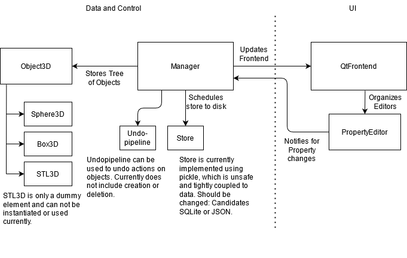
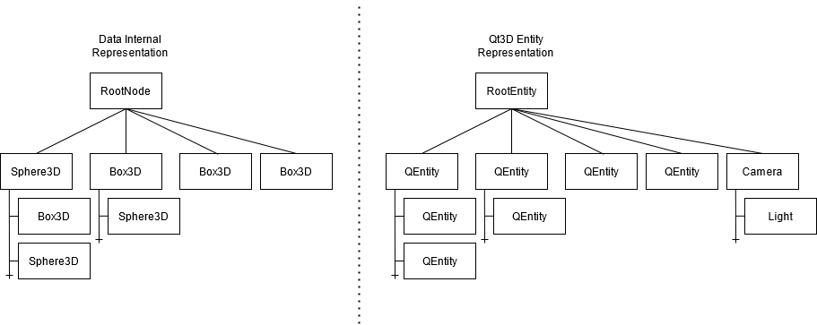

# 3D-Objects viewer

2 day Challenge.

Timeframe: 8am day 1 until 4pm day 2.

## Techstack

Pyside2 with Python 3.

## Target Features:

### Core

 * [✓] 3D Scene rendering
 * [✓] Camera movement, including rotation
 * [✓] Create and edit primitive shapes:
    * [✓] Spheres with variable radius
    * [✓] Boxes with 3 independent variable side lenghts
    * [✓] Position, rotation, color and name
 * [✓] Delete Shapes 
 * [✓] List all objects in scene
   * [✓] Select objects via list
 * [✓] Persistent data storage with auto-save

### Additional

 * [ ] Clicking and dragging of shapes to change their position and orientation
 * [ ] Click to select objects in Scene instead of list
 * [✓] Editing history of objects with undo and redo feature
   * [ ] Support for undo/redo of deletion/creation
 * [ ] Arbitrary shapes via stl import
 * [ ] Nested Objects
 * [ ] Dockerize

## Result

###

Features mostly build on Qt native components and support, i.e., chosing the right Qt component.
This turned out to be more and less challenging then expected - at the same time.
Qt3D provides remakable support for many of the desired features.

### Structure

The structure tries to separate Qt to the frontend (and translation between objects in the manager).
The internal data is the only thing written to disk, all Qt objects are built at runtime.
The file used for storage is fixed as "Shapes.db".

### Data

The data model presents a cleaner backend view.
Objects have some core properties such as position and rotation and are organized in a tree for nested objects.

The data is mirrored in Qt objects for presentation on the frontend, to allow for separation of Qt and the business logic.
This could be changed by fully embracing Qt even for the data representation.

Unfortunately, nested objects are not fully realized in creating them and presentation.

### Testing

Only the undopipeline and its operations class has any testcoverage.

### Dockerization

The dockerization of the GUI app was a failure so far.
The host machine being windows created part of the problem - making forwarding of x not a solution.
